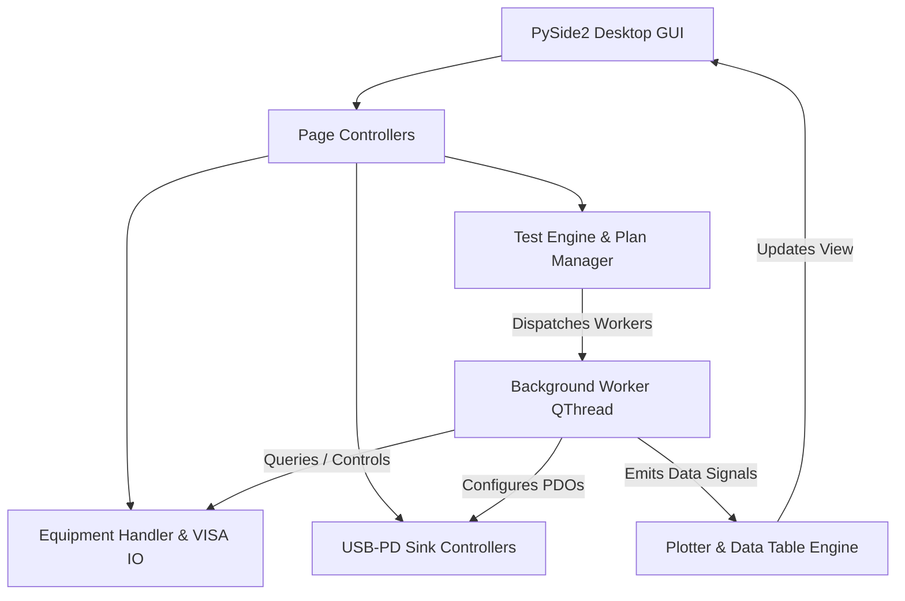
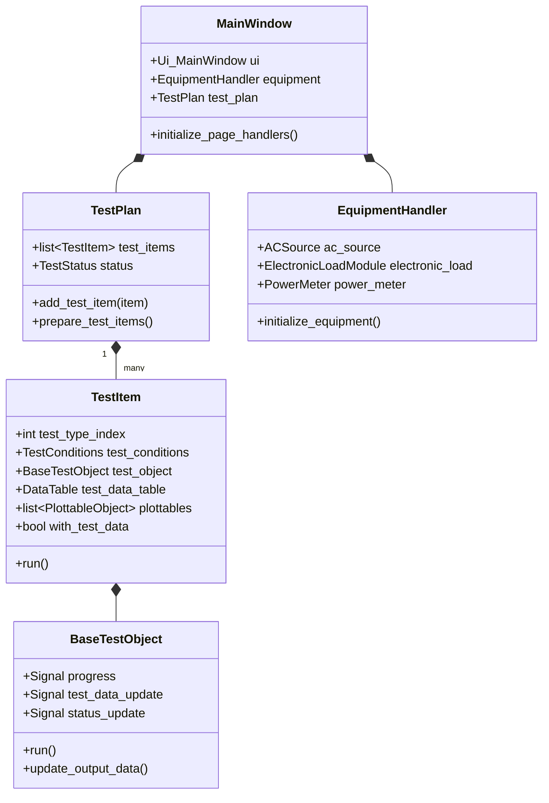
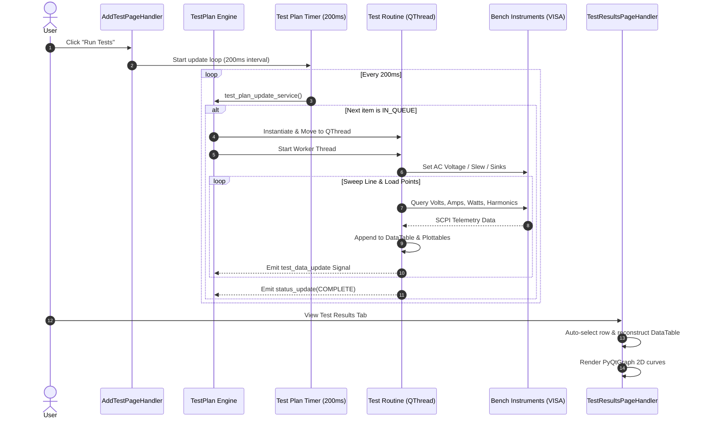

# PI ATE Software Architecture Documentation

This document describes the high-level architecture, design patterns, threading model, and subsystem interactions of the **Power Integrations Automated Test Equipment (PI ATE)** platform.

---

## 1. System Overview

PI ATE is a modular, event-driven desktop application built on **Python 3.10** and **PySide2 (Qt for Python)**. It orchestrates bench equipment (AC sources, electronic loads, power meters, USB-PD sinks) to perform automated characterization and validation of AC-DC and DC-DC power supply units.

---

## 2. Layered Architecture

The application is structured into six decoupled layers:

| Layer | Primary Packages / Modules | Description |
|---|---|---|
| **Presentation (UI)** | `ui/`, `ui/ui_main.py`, `ui/ui_styles.py` | Qt Designer UI files compiled to Python classes, custom dark theme styling, responsive layouts, and icon assets. |
| **Page Controllers** | `page_controls/` (`add_test`, `test_results`, `manual_control`, `equipment_setup`) | Event handlers bridging UI user interactions with the underlying test engine and instrument sessions. |
| **Test Planning & Execution** | `psu_tests/` (`tests.py`, `test_load_reg.py`, `test_efficiency.py`, `base_test_class.py`) | Test item queue management, sweep logic, automated measurement routines, and condition objects. |
| **Data & Visualization** | `plotter/` (`plotter.py`, `DataTable`, `PlottableObject`, `PlotSeries`) | Dynamic multidimensional test data tables and real-time PyQtGraph plotting surfaces. |
| **Hardware Abstraction (HAL)** | `equipment/` (`handler.py`, `equipment.py`, `power_meter_specs.py`, `ac_source.py`, `electronic_load.py`) | PyVISA communication layer with automatic retry decorators, SCPI protocol drivers, and safe float parsing. |
| **USB-PD / Sink Control** | `sink_controllers/`, `pd/` | HID and serial USB-PD sink communication for Fixed Supply PDO and Augmented PPS profile testing. |

---

## 3. Subsystems & Component Interaction

---

## 4. Test Execution & Telemetry Lifecycle

Each test run proceeds asynchronously to prevent GUI blocking during long-duration instrument sweeps (soak times, voltage ramps, and current steps).

---

## 5. Key Design Principles & Resilience

### 1. Robust Instrument Communication (`@visa_io` & SCPI Parsing)
Bench instrument communication over USB, GPIB, and RS-232 can produce intermittent latency or buffer noise (e.g., query headers such as `:MEAS:VOLT? 5.000E+00`).
* **VISA Retry Decorator** ([`equipment/equipment.py`](equipment/equipment.py)): Catches `VisaIOError`, `TypeError`, and `ValueError` exceptions with configurable exponential retry backoff.
* **Safe Float Parsing** ([`equipment/power_meter_specs.py`](equipment/power_meter_specs.py)): Utilizes regex numeric extraction (`parse_float_response`) to guarantee clean floating-point conversion even when headers or non-numeric tokens are returned by the instrument.

### 2. Non-Blocking Threading Model
* The main Qt UI thread remains responsive at 60 FPS at all times.
* All instrument sweeps, settling delays, and I/O wait times occur strictly within dedicated background `QThread` instances.
* Thread-safe communication with the UI is handled strictly through Qt Signals and Slots (`test_data_update`, `progress`, `status_update`).

### 3. Dynamic Results Table Reconstruction
* Tests produce variable-width datasets (e.g., 7 columns for basic sweeps, 14 columns for full Load Regulation with ripple and efficiency).
* The results view ([`page_controls/test_results.py`](page_controls/test_results.py)) dynamically recalculates table headers, column dimensions, and cell formatting directly from the active item's `DataTable` without hardcoded column assumptions.

---

## 6. Persistence & Configuration Management

* **Test Plan Auto-Save**: Any addition, re-ordering, or removal in the Test List immediately syncs to a JSON cache, allowing resumption of test configurations across application restarts.
* **Dual Logging System** ([`main.py`](main.py)): Standard `sys.stdout` and `sys.stderr` streams are redirected to a `DualLogger` that outputs to the console while simultaneously appending timestamped messages and unhandled traceback exceptions to `app_log.txt`.
