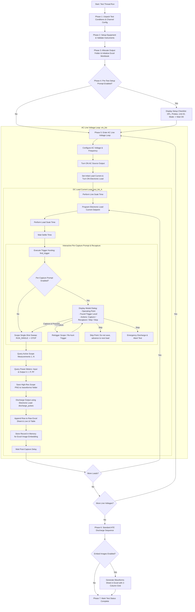

# Architecture & Sequence Document: Steady-State Waveform Capture

This document details the complete technical architecture, end-to-end test execution sequence, user prompt handling, on-the-fly waveform recapture workflow, and data storage format for the **`Steady-State Waveform Capture`** test in **PI-ATE**.

---

## 1. Executive Summary

The **`Steady-State Waveform Capture`** test generalizes waveform acquisition into a flexible, multi-channel automated test applicable to any power converter topology and signal combination (e.g., Primary $V_{DS}$, Drain Current $I_{DS}$, Secondary Diode $V_{DIODE}$, Gate Drive $V_{GS}$, Output Ripple, Aux Winding Voltage).

### Key Architectural Pillars:
1. **Dynamic 4-Channel Configuration:** 4 independent channel rows (CH1–CH4), each with an `[x] Enabled` checkbox and an editable `Signal Name` textbox.
2. **Dynamic Scope Measurement Discovery:** Automatically queries all active measurement slots configured on the oscilloscope screen (e.g. from a loaded `.DFL` setup file) and logs them into dynamic Excel columns.
3. **Interactive User Prompts & On-The-Fly Recapture:** A dedicated per-capture dialog offering **[Capture & Proceed]**, **[Recapture / Retrigger]**, **[Skip Point]**, and **[Stop Test]**.
4. **Dual Data Storage:**
   - Dedicated disk directory containing standalone, high-resolution PNG image files:
     `{unit_id}_{vin}VAC_{test_mode}_Io_{iout}A.png`
   - Formatted Excel Workbook (`.xlsx`) containing:
     - **Raw Data Sheet:** Synchronized electrical data ($V_{IN}, I_{IN}, P_{IN}, PF, V_O, I_O, P_O$), scope trigger data, active oscilloscope measurements, and image links.
     - **Waveforms Sheet:** Presentation-ready 2-column image gallery with embedded screenshots and measurement annotations.

---

## 2. End-to-End Test Execution Sequence



---

## 3. Scope Channel Configuration & UI Architecture

### A. Layout in Scope & Trigger Settings (`gridLayout_12`)
The static single-string dropdown (`Channel Probe Setup`) is replaced by a dedicated 4-channel configuration matrix arranged in 2 columns:

```
+------------------------------------+------------------------------------+
| [x] CH1: [ Primary Vds           ] | [x] CH2: [ Ids                   ] |
+------------------------------------+------------------------------------+
| [ ] CH3: [                       ] | [ ] CH4: [                       ] |
+------------------------------------+------------------------------------+
```

- **Checkboxes (`[x] CH1` to `[x] CH4`):** Controls whether each channel is active in the test.
- **Signal Name Textboxes:** Free-form text fields allowing the user to label what signal is probed (e.g. `Primary Vds`, `Ids`, `Vdiode`, `Vgate`, `Ripple`).
- **Interactive State Binding:**
  - Toggling an `[ ]` checkbox OFF automatically grays out and disables its text box.
  - Toggling an `[x]` checkbox ON enables its text box.
  - The **`Trigger Channel`** dropdown dynamically refreshes to list only the currently enabled channels (e.g., if CH1 and CH2 are checked, the dropdown only offers `CH1` and `CH2`).

### B. Default Configuration
- **CH1:** Enabled `[x]`, Signal Name: `"Primary Vds"`
- **CH2:** Enabled `[x]`, Signal Name: `"Ids"`
- **CH3:** Disabled `[ ]`, Signal Name: `""` (disabled until checked)
- **CH4:** Disabled `[ ]`, Signal Name: `""` (disabled until checked)

---

## 4. User Prompts & On-The-Fly Recapture Workflow

User prompts are governed by the **`User Prompts`** dropdown with four operating modes:
1. `None (Fully Automated)`: Unattended automated execution.
2. `Pre-Test Only`: Interactive checklist before running; fully automated afterwards.
3. `Per-Capture Only`: Prompts before capturing every operating point.
4. `Pre-Test & Per-Capture`: Both pre-test verification and per-capture interaction.

---

### A. Pre-Test Verification Checklist
Emitted prior to turning ON the AC source:

```
==================== OSCILLOSCOPE SETUP REMINDER ====================
Test Type: Steady-State Waveform Capture
Unit ID: RE_05 | Test Mode: NORMAL | Ambient Temp: 25.0 °C
Nominal Ratings: 20.0 V / 5.0 A (Max: 5.0 A)

Configured Scope Channels:
  • CH1: Primary Vds
  • CH2: Ids
Trigger Source: CH1 (Delta: 3.0 V)

Checklist:
1. Load the corresponding .DFL setup file into the oscilloscope.
2. Confirm probe attenuations and current probe degaussing.
3. Verify oscilloscope Ethernet / VISA connection.
=====================================================================
Click [OK] to begin test execution.
```

---

### B. Per-Capture Interactive Dialog & Recapture
At each operating point, after setting line/load, waiting settle time, and running the trigger hunt algorithm, the runner displays a modal dialog:

```
+-------------------------------------------------------------------------+
| Oscilloscope Waveform Confirmation                                      |
+-------------------------------------------------------------------------+
| Operating Point: 115 VAC @ 60 Hz | Load: 5.0 A (100%)                   |
| Unit ID: RE_05 | Test Mode: NORMAL                                      |
| Locked Trigger Level: CH1 @ 425.5 V                                     |
|                                                                         |
| Active Channels:                                                        |
|   CH1: Primary Vds                                                      |
|   CH2: Ids                                                              |
|                                                                         |
| Review the waveform on the oscilloscope screen.                         |
+-------------------------------------------------------------------------+
| [ Capture & Proceed ]   [ Recapture / Retrigger ]   [ Skip ]   [ Stop ] |
+-------------------------------------------------------------------------+
```

#### Button Action Matrix:
| Button | Action | State Machine Transition |
| :--- | :--- | :--- |
| **`[ Capture & Proceed ]`** | Accepts current waveform. Issues single sweep $\rightarrow$ queries scope measurements $\rightarrow$ grabs PNG $\rightarrow$ discharges output $\rightarrow$ appends Excel row. | Advances to next load point ($I_{OUT}[n+1]$). |
| **`[ Recapture / Retrigger ]`** | Re-arms the oscilloscope trigger, re-runs `find_trigger()`, updates the dialog with the newly locked trigger level, and keeps the DUT energized. | Remains on the current operating point for review. |
| **`[ Skip ]`** | Bypasses screen capture and data recording for this operating point. Safely discharges output. | Advances to next load point ($I_{OUT}[n+1]$). |
| **`[ Stop ]`** | Immediately turns OFF AC supply, initiates standard multi-channel electronic load discharge sequence, and aborts test. | Emits `TestStatus.STOPPED` and terminates thread. |

---

## 5. Oscilloscope Measurement Discovery Architecture

Instead of hardcoding channel measurements, the test dynamically queries active measurement slots from the oscilloscope:

```python
# Dynamic measurement discovery loop
active_measurements = {}
for slot in range(1, 9):  # Oscilloscope supports up to 8 active measurement slots
    try:
        labels, values = self.oscilloscope.get_measure(slot)
        if values and len(values) > 0 and values[0] is not None and not math.isnan(values[0]):
            meas_label = labels[0] if labels else f"Meas_{slot}"
            active_measurements[meas_label] = float(values[0])
    except Exception:
        break
```

- If Measurement 1 on the scope is `Vds Max` and Measurement 2 is `Ids Max`:
  - They are captured and labeled dynamically as `Vds Max (V)` and `Ids Max (A)`.
- If the engineer added `Vds RMS`, `Frequency`, or `Secondary Vdiode Max` to the scope:
  - PI-ATE automatically creates dedicated columns for them in the Excel sheet without requiring any code changes!

---

## 6. Complete Data Storage Architecture

### A. Filesystem Directory Layout
All test artifacts are saved inside the user-selected parent folder under a timestamped directory:

```
<Parent Folder>/
└── Test_Data_and_Waveforms_2026-09-04_13-20-00/
    ├── Steady-State Waveform Capture Test 20V.xlsx       <-- Excel Report
    └── waveforms/                                        <-- High-Resolution PNGs
        ├── RE_05_90VAC_NORMAL_Io_5A.png
        ├── RE_05_90VAC_NORMAL_Io_3.75A.png
        ├── RE_05_90VAC_NORMAL_Io_2.5A.png
        ├── RE_05_90VAC_NORMAL_Io_1.25A.png
        ├── RE_05_90VAC_NORMAL_Io_0A.png
        ├── RE_05_115VAC_NORMAL_Io_5A.png
        ├── ...
        └── RE_05_265VAC_NORMAL_Io_0A.png
```

---

### B. Waveform Screenshot File Specification
- **Directory:** `<run_folder>/waveforms/`
- **Naming Pattern:**
  $$\mathbf{\{unit\_id\}\_\{vin\}VAC\_\{test\_mode\}\_Io\_\{iout\}A.png}$$
  *Example:* `RE_05_115VAC_NORMAL_Io_5A.png`
- **Format:** Lossless 24-bit TrueColor PNG.
- **Resolution:** Full oscilloscope screen capture resolution (e.g. $1280 \times 800$ or $800 \times 480$).

---

### C. Excel Workbook Specification

The generated Excel workbook (`Steady-State Waveform Capture Test {Vout}V.xlsx`) contains two sheets:

#### 1. Raw Data Sheet (`SS_Waveform_{Coupling}_{Vout}V_{Imax}A`)
- **Row 2:** Test Title Banner (14pt bold Navy).
- **Row 3:** Metadata Banner:
  ```text
  Unit ID: RE_05 | Test Mode: NORMAL | Ambient Temp: 25.0 °C | Nominal Vout: 20.0 V | Nominal Iout: 5.0 A | Max Iout: 5.0 A | Channels: CH1: Primary Vds, CH2: Ids
  ```
- **Row 5:** Header Row (Dark blue `#2952A3`, white bold text, centered).
- **Columns Structure:**

| Col # | Header Name | Unit | Category | Description |
| :---: | :--- | :---: | :---: | :--- |
| **B** | `Vin Set` | V | Programmed | Programmed AC voltage |
| **C** | `Freq` | Hz | Programmed | Programmed AC frequency |
| **D** | `Vin Meas` | V | Power Meter | Measured AC RMS voltage |
| **E** | `Iin` | mA | Power Meter | Measured AC RMS current |
| **F** | `Pin` | W | Power Meter | Measured active input power |
| **G** | `PF` | — | Power Meter | Measured power factor |
| **H** | `Vo Set` | V | Programmed | Programmed nominal output voltage |
| **I** | `Vo Meas` | V | Power Meter | Measured DC output voltage |
| **J** | `Io` | A | Programmed | Output load current setpoint |
| **K** | `Po` | W | Power Meter | Measured DC output power |
| **L** | `Trig Ch` | — | Scope Trigger | Trigger source channel (e.g. `CH1`) |
| **M** | `Trig Level` | V | Scope Trigger | Locked trigger voltage threshold |
| **N..N+k** | `[Scope Meas 1..k]` | V / A | Oscilloscope | Dynamically discovered scope measurements |
| **Last** | `Waveform File` | — | Link / File | Filename of the captured PNG image |

---

#### 2. Waveforms Sheet (`SS_Waveform_Waveforms`)
- Presentation-ready report sheet embedding the captured PNG images.
- **Grid Layout:** 2 columns side-by-side:
  - **Left Column:** Column B (starts row 4).
  - **Right Column:** Column G (starts row 4).
  - **Row Step:** 18 rows between successive image pairs.
- **Image Formatting:**
  - Embedded image width: $420\text{ px}$, height: $315\text{ px}$.
  - Anchored directly below condition title cell.
- **Condition Title Cell (11pt bold Navy):**
  $$\text{\{Vin\} VAC, \{Io\} A | \{Meas\_1\_Label\}: \{val\_1\} | \{Meas\_2\_Label\}: \{val\_2\}}$$
  *Example:* `115 VAC, 5 A | Primary Vds Max: 432.5V | Ids Max: 4.82A`

---

### D. Test Plan File Serialization (`.ate` / JSON)

The complete generic channel and scope configuration is preserved in `.ate` plan files:

```json
{
  "test_type": "Steady-State Waveform Capture",
  "nominal_output_voltage_V": 20.0,
  "nominal_load_current_A": 5.0,
  "max_load_current_A": 5.0,
  "UNIT_ID": "RE_05",
  "TEST_MODE": "NORMAL",
  "AMBIENT_TEMP": 25.0,
  "scope_channels": {
    "1": { "enabled": true, "name": "Primary Vds" },
    "2": { "enabled": true, "name": "Ids" },
    "3": { "enabled": false, "name": "" },
    "4": { "enabled": false, "name": "" }
  },
  "i2c_test_parameters": {
    "cbx_param": ["CH1", "Yes", "Pre-Test & Per-Capture"],
    "param": [3.0, 1.0, 2, 25.0, 1.0]
  },
  "line_range": { "vin_freq": [[90, 60], [115, 60], [230, 50], [265, 50]] },
  "load_range": { "load_percentage": [100, 75, 50, 25, 0] }
}
```
